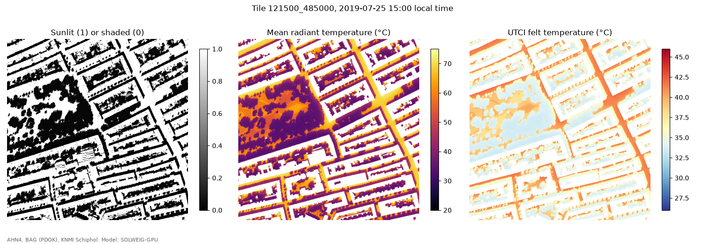

# amsterdam_heat

Street-level heat stress and shade for Amsterdam, rebuilt every year from open aerial imagery and LiDAR.

The national felt-temperature map in the Klimaateffectatlas is a good start, but it is built from AHN3, covers a single idealised summer day and cannot answer "what if we plant a tree here?". This project aims to:

1. map the current tree canopy from AHN4, the city's leaf-on summer infrared photo and the municipal tree register,
2. compute shade, mean radiant temperature and UTCI at 0.5 to 1 m resolution for real heatwave days with SOLWEIG running on a laptop GPU (Apple Metal),
3. find plantable space from the imagery,
4. rank candidate tree locations by how much heat stress they remove for vulnerable people (care homes, schools, playgrounds, bus stops, elderly residents).

It is a screening tool meant to support planning, not a replacement for detailed site studies.

## Setup

Requires [uv](https://docs.astral.sh/uv/) and GDAL (on macOS: `brew install gdal`; the Python
bindings in `pyproject.toml` are pinned to the Homebrew version).

```bash
git clone --recursive https://github.com/iadicarlo/amsterdam_heat.git
uv sync                  # core environment
uv sync --extra ml       # imagery models (samgeo, DeepForest)
uv run python -c "import torch; print(torch.backends.mps.is_available())"
```

## Running one tile

```bash
# download open data and build SOLWEIG inputs for a 500 m tile (RD New lower left corner)
uv run python scripts/make_tile.py --x 121500 --y 485000 --date 2019-07-25
# shade, mean radiant temperature and UTCI for every hour of that day, on the Mac GPU
uv run python scripts/run_solweig.py --tile 121500_485000 --date 2019-07-25 --device mps --fresh
uv run python scripts/plot_tile.py --tile 121500_485000 --device mps --hour 15
# felt temperature (PET) and Amsterdam's shade and cool-spot guidelines, on the reference hot day
uv run python scripts/run_solweig.py --tile 121500_485000 --date 2015-07-01 --device mps --fresh
uv run python scripts/compute_pet.py --tile 121500_485000 --date 2015-07-01
uv run python scripts/check_guidelines.py --tile 121500_485000 --date 2015-07-01
```

Street-level wind uses the GLIDE-SOL coefficients (Zonato et al. 2026). The guideline check scores
shade on the city's pedestrian PLUS and HOOFD routes (target 40%) and on neighbourhood walking
areas (30%) at 11:00, 15:00 and 17:00, and the walking distance from every home to a cool spot
(afternoon PET of 35 C or lower in a public green space, within 300 m). First result for De Pijp:
[docs/guidelines_121500_485000_2015-07-01.md](docs/guidelines_121500_485000_2015-07-01.md).


The radiation model is SOLWEIG-GPU, used through a fork that adds Apple Silicon (MPS) support:
`external/solweig-gpu` (branch `apple-mps`). Clone with `git clone --recursive`.

Full day (24 hours) for a 700 × 700 m tile on an M4 MacBook Pro, fresh run:

| Resolution | Mac GPU (MPS) | CPU |
|---|---|---|
| 1 m (700 × 700 cells) | 2.0 min | 2.4 min |
| 0.5 m (1400 × 1400 cells) | 9.5 min | 43.9 min |

The sky view factor is cached and reused for other days.

**Checks.** GPU and CPU runs agree to 0.001 K in all but one cell-hour
([GPU vs CPU](docs/validation_121500_485000_mps_vs_cpu.md)). Against UMEP's own SOLWEIG code (numpy,
double precision), hourly shadows are identical and sky view factors agree to better than 1e-5 on
average ([UMEP check](docs/validation_121500_485000_umep.md)). Getting there meant fixing two
upstream sky view factor issues in the fork (patch azimuths, vegetation shadow scheme). Metal support
has been offered upstream in
[nvnsudharsan/SOLWEIG-GPU#138](https://github.com/nvnsudharsan/SOLWEIG-GPU/issues/138).



See [docs/data_sources.md](docs/data_sources.md) for which photos are leaf-on, and the validation data.

## Layout

```
data/raw        downloaded source data, never edited (not in git)
data/interim    clipped, reprojected, tiled intermediates (not in git)
data/processed  model outputs (not in git)
src/amsterdam_heat  library code
scripts         command line entry points (download, preprocess, run)
notebooks       exploration only, nothing the pipeline depends on
docs            methods notes and best practices
references      bibliography (references.bib) and reading notes
figures         figures for reports and the pitch
external        third party code we patch (for example SOLWEIG-GPU)
```

## Data

All inputs are open data:

| Dataset | Source | Licence |
|---|---|---|
| Aerial photo, colour infrared, summer 2023 (leaf-on) | Gemeente Amsterdam (map.data.amsterdam.nl) | CC BY 4.0 |
| Aerial photos RGB and CIR, 5 to 8 cm, yearly, spring (leaf-off) | Beeldmateriaal Nederland via PDOK | CC BY 4.0 |
| AHN4 point cloud and DSM/DTM, 0.5 m | Rijkswaterstaat / Het Waterschapshuis via PDOK | CC0 |
| 3D BAG buildings | TU Delft 3D geoinformation | CC BY 4.0 |
| BGT large scale topography | Kadaster via PDOK | CC0 |
| Tree register (Bomen) | Gemeente Amsterdam, data.amsterdam.nl | open |
| Hourly weather | KNMI station Schiphol (240) | CC BY 4.0 |
| Land surface temperature (validation) | Landsat 8/9 Collection 2 | public domain |

All grids use the Dutch national grid, RD New (EPSG:28992).

## Licence

Code: GPL-3.0 (we build on SOLWEIG-GPU, which is GPL-3.0).
