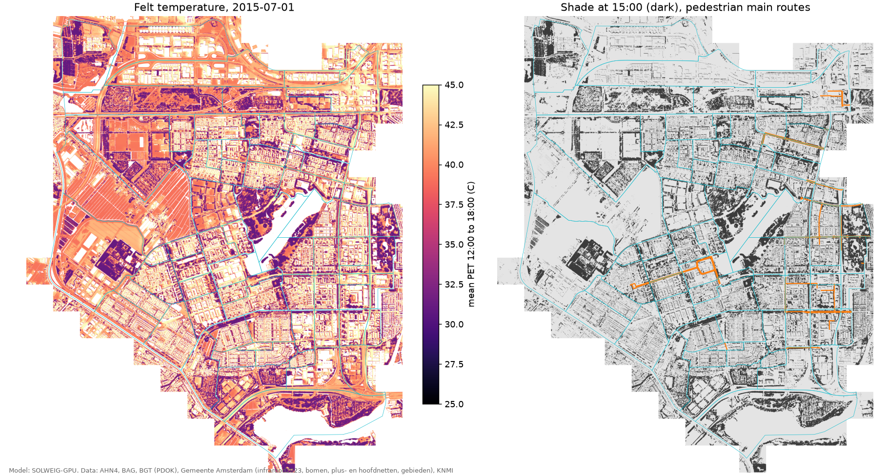

# amsterdam_heat

Street-level shade and heat stress for Amsterdam at 1 m, from open data, run on a MacBook GPU.

The national felt-temperature map uses AHN3 and one idealised summer day, and cannot answer "what if we plant a tree here?". This project maps today's trees from the city's summer infrared photo and tree register, computes shade, mean radiant temperature, UTCI and PET with SOLWEIG for real hot days, checks the result against Amsterdam's heat guidelines, and ranks places where new trees help most. It is a screening tool, not a replacement for site studies.



## Results so far

All of Nieuw-West (177 tiles, 64 neighbourhoods) on 1 July 2015, the reference hot day of the national PET map. Only 10 of 43 main pedestrian streets have the 40% shade the city's guideline asks at 15:00, and 41 of 73 neighbourhoods miss 30% on their pavements ([docs/guidelines_nieuw-west_2015-07-01.md](docs/guidelines_nieuw-west_2015-07-01.md)).

Where to plant: 35 new trees bring the main route pavements around Osdorpplein from 28% to 40% shade, and 189 trees bring De Aker's pavements from 20% to 30%. Under the new crowns the afternoon felt temperature drops by 4.5 to 5.3 C. Spots are chosen one at a time where they add the most shade and then checked with the full model ([Osdorpplein](docs/trees_osdorpplein.md), [De Aker](docs/trees_de-aker.md)).

The model is checked against street measurements of the HvA ([docs/validation_hva.md](docs/validation_hva.md)) and the WUR ([docs/validation_wur.md](docs/validation_wur.md)); afternoon air temperature includes a heat island fitted to 45 street stations ([docs/uhi.md](docs/uhi.md)).

## Setup

Needs [uv](https://docs.astral.sh/uv/) and GDAL (`brew install gdal`).

```bash
git clone --recursive https://github.com/iadicarlo/amsterdam_heat.git
uv sync
```

## One tile, one day

```bash
uv run python scripts/make_tile.py --x 121500 --y 485000 --date 2015-07-01
uv run python scripts/run_solweig.py --tile 121500_485000 --date 2015-07-01 --device mps --fresh
uv run python scripts/compute_pet.py --tile 121500_485000 --date 2015-07-01
uv run python scripts/check_guidelines.py --tile 121500_485000 --date 2015-07-01
```

Tiles are 500 m with a 100 m buffer, in RD New (EPSG:28992). Street wind uses the GLIDE-SOL coefficients (Zonato et al. 2026).

## Model

SOLWEIG-GPU through our fork with Apple Silicon support ([branch apple-mps](https://github.com/iadicarlo/SOLWEIG-GPU/tree/apple-mps)). Shadows, the sky view factor and the hourly sky radiation run as fused Metal kernels. On an M4 MacBook Pro a 700 x 700 tile at 1 m takes 43 s for its first day and 10 s for each further day, since walls and sky view factors are kept per tile (0.5 m: 2.1 min, then 25 s). Shadows and sky view factors match UMEP's own SOLWEIG code; see [docs/validation_121500_485000_umep.md](docs/validation_121500_485000_umep.md).

## Data

All open: AHN4 heights, BAG and BGT (PDOK), the Gemeente Amsterdam 2023 summer infrared photo, tree register, pedestrian networks and neighbourhoods, KNMI Schiphol hourly weather, and the HvA thermal comfort measurements for validation. Sources and licences: [docs/data_sources.md](docs/data_sources.md).

## Docs

- [roadmap.md](docs/roadmap.md): what comes next
- [best_practices.md](docs/best_practices.md): working rules and known pitfalls
- [style.md](docs/style.md): how we write in this repository
- [paris.md](docs/paris.md): the same pipeline for Paris
- [references/reading_notes.md](references/reading_notes.md): the papers we build on

## Licence

GPL-3.0, as SOLWEIG-GPU.
