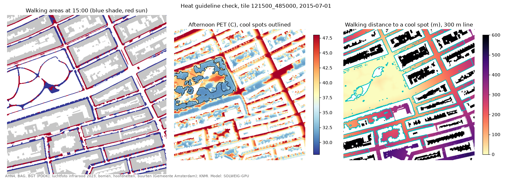

# amsterdam_heat

Street-level shade and heat stress for Amsterdam at 1 m, from open data, run on a MacBook GPU.

The national felt-temperature map uses AHN3 and one idealised summer day, and cannot answer "what if we plant a tree here?". This project maps today's trees from the city's summer infrared photo and tree register, computes shade, mean radiant temperature, UTCI and PET with SOLWEIG for real hot days, checks the result against Amsterdam's heat guidelines, and will rank places where new trees help most. It is a screening tool, not a replacement for site studies.



## First result

De Pijp on 1 July 2015, the reference hot day of the national PET map: all pedestrian main routes have at least 40% shade at 15:00, and 75% of homes are within 300 m walking of a cool spot (Sarphatipark). Details in [docs/guidelines_121500_485000_2015-07-01.md](docs/guidelines_121500_485000_2015-07-01.md).

## Setup

Needs [uv](https://docs.astral.sh/uv/) and GDAL (`brew install gdal`).

```bash
git clone --recursive https://github.com/iadicarlo/amsterdam_heat.git
uv sync
```

## One tile, one day

```bash
uv run python scripts/make_tile.py --x 121500 --y 485000 --date 2015-07-01
uv run python scripts/run_solweig.py --tile 121500_485000 --date 2015-07-01 --device mps --fresh
uv run python scripts/compute_pet.py --tile 121500_485000 --date 2015-07-01
uv run python scripts/check_guidelines.py --tile 121500_485000 --date 2015-07-01
```

Tiles are 500 m with a 100 m buffer, in RD New (EPSG:28992). Street wind uses the GLIDE-SOL coefficients (Zonato et al. 2026).

## Model

SOLWEIG-GPU through our fork with Apple Silicon support ([branch apple-mps](https://github.com/iadicarlo/SOLWEIG-GPU/tree/apple-mps)). Shadows and the sky view factor run as fused Metal kernels. A full day on an M4 MacBook Pro takes 1.2 min for a 700 x 700 tile at 1 m and 4.4 min at 0.5 m (CPU: 2.8 and 13.8 min). Shadows and sky view factors match UMEP's own SOLWEIG code; see [docs/validation_121500_485000_umep.md](docs/validation_121500_485000_umep.md).

## Data

All open: AHN4 heights, BAG and BGT (PDOK), the Gemeente Amsterdam 2023 summer infrared photo, tree register, pedestrian networks and neighbourhoods, KNMI Schiphol hourly weather, and the HvA thermal comfort measurements for validation. Sources and licences: [docs/data_sources.md](docs/data_sources.md).

## Docs

- [roadmap.md](docs/roadmap.md): what comes next
- [best_practices.md](docs/best_practices.md): working rules and known pitfalls
- [style.md](docs/style.md): how we write in this repository
- [paris.md](docs/paris.md): the same pipeline for Paris
- [references/reading_notes.md](references/reading_notes.md): the papers we build on

## Licence

GPL-3.0, as SOLWEIG-GPU.
