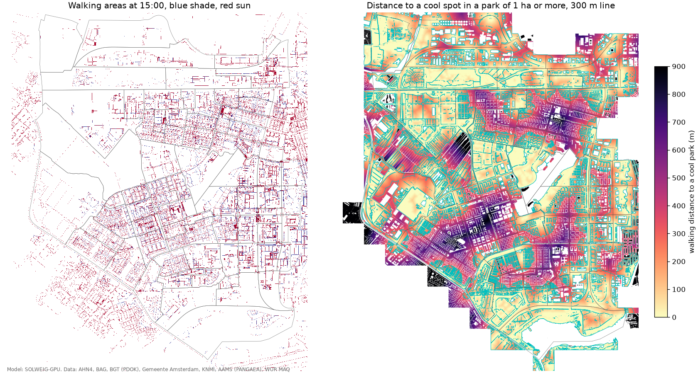

# Heat guidelines in Nieuw-West, 2015-07-01

Shade at sun positions of 11:00, 15:00 and 17:00 local time, on walking areas from the BGT. Cool spots: afternoon PET of 35 C or lower (with the afternoon heat island added), at least 200 m2, inside public green of at least 1000 m2 (BGT green closer than 5 m merged). In a garden city most courtyards and green strips pass that, so we also count only parks of at least 1 ha. Distances are walked around buildings and water.

| Guideline | Result |
|---|---|
| Pedestrian routes with 40% shade at 15:00 | 10 of 43 streets, 24% of route walking area |
| Neighbourhoods with 30% shade on walking areas at 15:00 | 32 of 73 |
| Homes within 300 m walking of a cool spot | 100% of 21057 residential buildings |
| Same, counting only parks of at least 1 ha | 45% |

## Least shaded pedestrian routes at 15:00

| Street | Network | Walking area (m2) | 11:00 | 15:00 | 17:00 |
|---|---|---|---|---|---|
| KARL POPPERLAAN | HOOFD | 1090 | 19% | 1% | 3% |
| Changiweg | PLUS | 3231 | 1% | 1% | 0% |
| Bos en Lommerweg | PLUS | 1694 | 9% | 4% | 5% |
| EINSTEINWG | HOOFD | 664 | 18% | 10% | 9% |
| Jan van Galenstraat | HOOFD | 3458 | 12% | 10% | 12% |
| Arlandaweg | HOOFD | 546 | 10% | 12% | 14% |
| Belgiëplein | PLUS | 2036 | 20% | 15% | 25% |
| Robert Fruinlaan | HOOFD | 1392 | 20% | 16% | 22% |
| Meer en Vaart | PLUS | 3041 | 16% | 16% | 29% |
| Schipluidenlaan | HOOFD | 951 | 15% | 17% | 17% |
| Johan Huizingalaan | HOOFD | 2989 | 46% | 17% | 32% |
| Tussen Meer | HOOFD | 16004 | 26% | 17% | 13% |
| Teleportboulevard | PLUS | 4509 | 23% | 19% | 18% |
| Jan Evertsenstraat | HOOFD | 6879 | 22% | 20% | 21% |
| Jan Tooropstraat | HOOFD | 6241 | 37% | 22% | 41% |

## Neighbourhoods

| Buurt | Shade on walking areas at 15:00 | Homes within 300 m of a cool spot | Of a cool park of 1 ha | Residents |
|---|---|---|---|---|
| Riekerhaven | 13% | 100% | 100% | 410 |
| Sloterdijk Poort-Zuid | 14% | 100% | 95% | 115 |
| De Aker-Oost | 19% | 100% | 28% | 5835 |
| Sloterdijk Stationskwartier | 19% | 100% | 100% | 1155 |
| Osdorper Bovenpolder | 20% | 99% | 87% | 745 |
| Schipluidenbuurt | 20% | 100% | 100% | 1625 |
| Middelveldsche Akerpolder | 20% | 100% | 32% | 4045 |
| Ookmeer | 20% | 100% | 100% | 440 |
| De Aker-West | 21% | 100% | 14% | 4500 |
| Lucas/Andreasziekenhuis e.o. | 21% | 100% | 100% | 1245 |
| Arondeusbuurt | 21% | 100% | 46% | 2740 |
| Andreasterrein | 22% | 100% | 100% | 1270 |
| Calandlaan/Lelylaan | 22% | 100% | 12% | 1250 |
| Confuciusbuurt | 24% | 100% | 76% | 3985 |
| Riekerpolder | 24% | 100% | 93% | 695 |
| Sloterweg e.o. | 24% | 100% | 94% | 315 |
| De Eendracht | 24% | 100% | 87% | 2445 |
| Bedrijvencentrum Osdorp | 25% | 100% | 100% | 125 |
| Park Haagseweg | 25% | 100% | 50% | 985 |
| Van Tijenbuurt | 25% | 100% | 93% | 2955 |
| Belgiëplein e.o. | 25% | 100% | 18% | 1155 |
| Overtoomse Veld-Noord | 26% | 100% | 45% | 5840 |
| Wegener Sleeswijkbuurt | 26% | 100% | 66% | 1485 |
| Osdorpplein e.o. | 27% | 100% | 4% | 4780 |
| Zuidwestkwadrant-Noord | 27% | 100% | 0% | 3130 |
| Dobbebuurt | 27% | 100% | 5% | 3035 |
| Nieuw-Sloten-Noordoost | 27% | 100% | 38% | 3220 |
| Bakemabuurt | 27% | 100% | 37% | 3105 |
| Ruys de Beerenbrouckbuurt | 27% | 100% | 31% | 6130 |
| Reimerswaal | 28% | 100% | 60% | 2755 |
| Staalmanbuurt | 29% | 100% | 50% | 3340 |
| Noordoever Sloterplas | 29% | 100% | 39% | 3395 |
| Meer en Oever | 29% | 100% | 90% | 3220 |
| Dichtersbuurt | 30% | 100% | 0% | 1070 |
| Medisch Centrum Slotervaart | 30% | 100% | 80% | 870 |
| Johan Jongkindbuurt | 30% | 100% | 66% | 1060 |
| Dorp Sloten | 30% | 100% | 99% | 705 |
| Nieuw-Sloten-Noordwest | 31% | 100% | 81% | 3035 |
| Louis Crispijnbuurt | 31% | 100% | 25% | 3310 |
| Dudokbuurt | 31% | 100% | 5% | 2735 |
| Jan de Louterbuurt | 31% | 100% | 36% | 3385 |
| Dijkgraafpleinbuurt | 33% | 100% | 52% | 6185 |
| Nieuw-Sloten-Zuidoost | 33% | 100% | 6% | 2170 |
| Zuidwestkwadrant-Zuid | 34% | 100% | 10% | 6200 |
| Osdorp-Zuidoost | 34% | 100% | 39% | 4165 |
| Oostoever Sloterplas | 34% | 100% | 94% | 2430 |
| Overtoomse Veld-Zuid | 34% | 100% | 37% | 4650 |
| Delflandpleinbuurt-West | 34% | 100% | 80% | 4775 |
| Meerwaldtbuurt | 35% | 100% | 37% | 1945 |
| Koningin Wilhelminaplein | 35% | 100% | 94% | 3065 |
| Lodewijk van Deysselbuurt | 35% | 100% | 9% | 3420 |
| Jacques Veltmanbuurt | 37% | 100% | 29% | 3750 |
| Delflandpleinbuurt-Oost | 37% | 100% | 42% | 2110 |
| Nieuw-Sloten-Zuidwest | 37% | 100% | 40% | 2195 |
| Jacob Geelbuurt | 37% | 100% | 53% | 3025 |
| Emanuel van Meterenbuurt | 40% | 100% | 59% | 2335 |
| Louis Couperusbuurt | 40% | 100% | 32% | 2320 |
| Coronelbuurt | 41% | 100% | 91% | 1540 |
| Wildeman | 41% | 100% | 43% | 4910 |
| Botteskerkbuurt | 43% | 100% | 6% | 3395 |
| Rembrandtpark-Noord | 47% | 100% | 100% | 1015 |
| Nieuwe Meer | 50% | 100% | 100% | 155 |
| Eendrachtspark | 50% | 100% | 100% | 300 |
| Rembrandtpark-Zuid | 55% | 100% | 100% | 875 |

