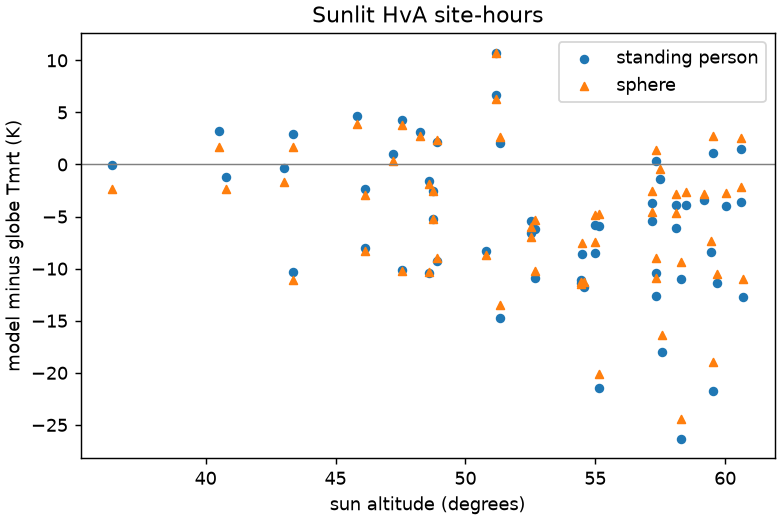

# Sphere or standing person

Model Tmrt minus globe Tmrt (K) for the HvA site-hours, with SOLWEIG's standing person and with a sphere-like body (equal weights in all six directions).

| Situation | n | Standing bias | Sphere bias | Standing RMSE | Sphere RMSE |
|---|---|---|---|---|---|
| shade of buildings | 3 | +4.3 | +2.3 | 7.4 | 6.4 |
| shade of trees | 15 | -1.1 | -2.4 | 3.3 | 3.8 |
| sun | 57 | -5.7 | -5.2 | 9.1 | 8.5 |

Sunlit hours by sun altitude:

| Sun altitude | n | Standing bias | Sphere bias |
|---|---|---|---|
| 0 to 45 degrees | 6 | -1.0 | -2.4 |
| 45 to 55 degrees | 28 | -4.4 | -4.4 |
| 55 to 70 degrees | 23 | -8.4 | -7.0 |

The sphere closes only about 1 K. The gap still grows with sun altitude, so body shape is not the main cause.

The globe side is far less certain. For the same sunlit hours, the model minus globe bias is:

| Globe formula | Bias (K) |
|---|---|
| Thorsson et al. 2007, as used | -5.7 |
| ISO 7726 | -1.5 |
| Thorsson, measured wind 30% lower | -0.2 |
| Thorsson, measured wind 30% higher | -12.1 |

The bias follows the measured wind (r = -0.50) more closely than sun altitude (r = -0.39), which points at the convection term of the small 38 mm globe. The sunlit gap lies inside the uncertainty of the reference, so these data cannot show a model error in the sun. The WUR street stations of 2025 and 2026, with black globes and wind on the same mast, are the next check.

