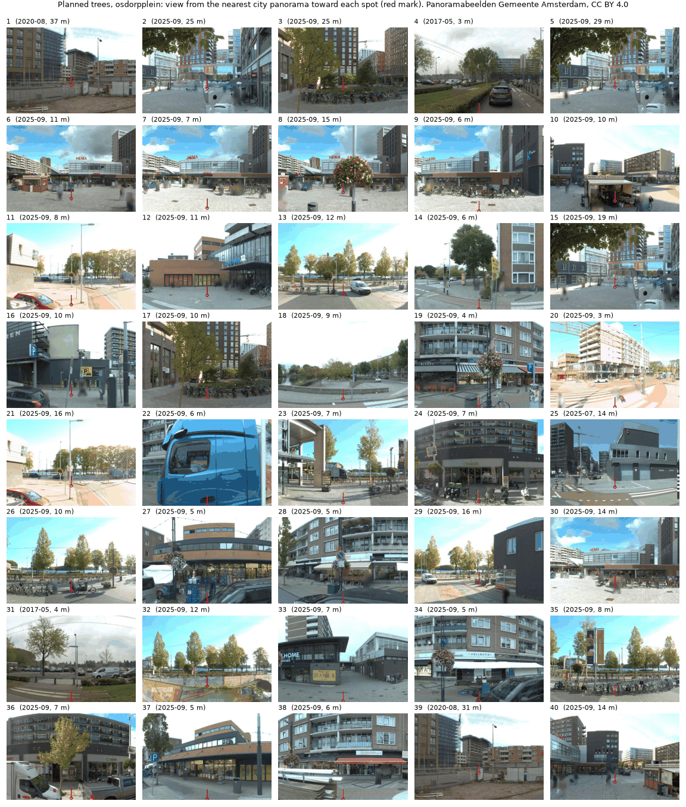
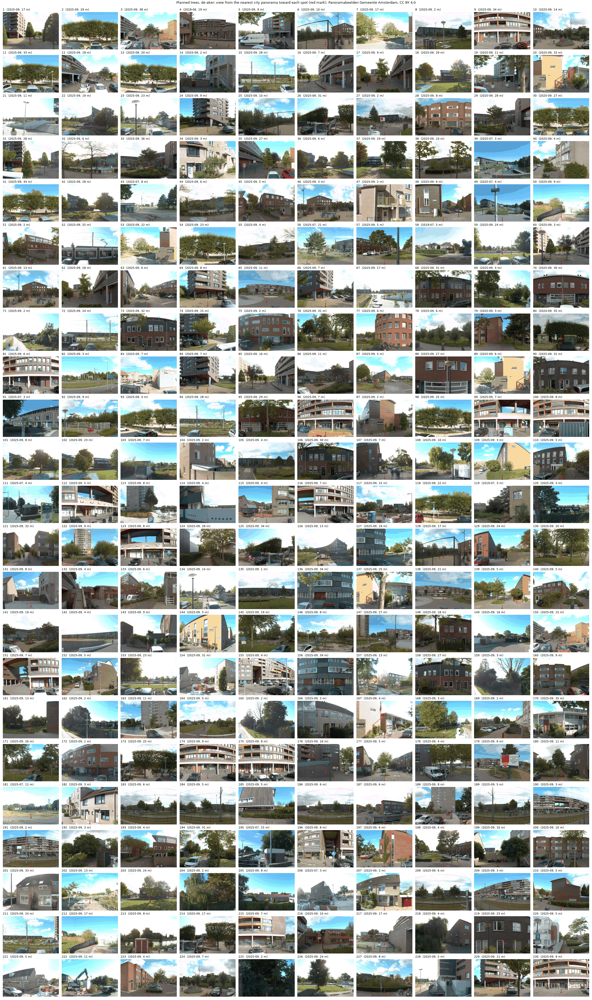

# Street check of the tree plans

Do the planned trees in Osdorpplein (40) and De Aker (230) land on free pavement? We checked each spot against street furniture in open data and looked at a city street photo of it. October 2026, plans as in commit 5892c56.

`scripts/check_streetscape.py --fetch` downloads the layers and writes `streetscape.csv` per plan; `scripts/street_photos.py` gets the photos and contact sheets. Logic is in `amsterdam_heat.streetscape`.

## Sources

| Layer | Source | Licence | In Nieuw-West |
|---|---|---|---|
| Parking bays | Gemeente Amsterdam `parkeervakken` (WFS) | open data | 67 922 |
| Underground containers | `huishoudelijkafval/containerlocatie` | public | 7 693 pits |
| Litter bins | `objectenopenbareruimte/afvalbakken` | public | 2 084 |
| Lampposts, cabinets, hydrants, shelters, tram rails | BGT plus layers kept by the city, via PDOK | CC0 | 37 437 lampposts |
| Bike racks, bus and tram stops | OpenStreetMap via Overpass | ODbL | 503 racks, 640 stops |
| Markets | Maps Amsterdam `MARKTEN` | Maps Amsterdam terms | 6, none near the plans |
| Replanting register, works plan | `bomen/kapenherplant`, `uitvoeringsplan` | public | for reference only |
| Street photos | Panoramabeelden Gemeente Amsterdam, `api.data.amsterdam.nl/panorama` | CC BY 4.0 | 2017 to 2025 |

Hydrants and cabinets are also used as utility proxies in [utilities.md](utilities.md). Not open: the city's growing places table (`bomen/groeiplaatsboom`, 403), so empty tree pits cannot be listed. No open layer of bike racks from the city; OSM misses many. Every container in the city register stands on a pit, so no separate above ground layer is left.

## Clearances

Trunk centre to object. Lampposts 4 m, from the municipal tree table (matentabel bomen, after Handboek Bomen 2014). Underground containers 7 m, half the crown plus 3 m for the crane, the Utrecht siting rule for a second size tree. Not on a parking bay. Our own screening values: 1 m from litter bins, cabinets, hydrants and bike racks, 1.5 m from shelters, 2 m from stops, 3 m from tram rails, 4 m from register trees.

## Conflicts

| Obstacle | Osdorpplein (40) | De Aker (230) |
|---|---|---|
| Lamppost within 4 m | 11 | 29 |
| Underground container within 7 m | 2 | 38 |
| Register tree within 4 m | 3 | 10 |
| Tram rail within 3 m | 0 | 5 |
| Stop within 2 m | 0 | 7 |
| On a parking bay | 0 | 4 |
| Litter bin within 1 m | 1 | 1 |
| Any | 16 | 79 |

The BGT rails and the bay register miss some cases the photos show: in De Aker 11 spots fall in the grassed tram bed and many sit on parking spaces outside the bay register.

## Photos

The view is cut toward the spot from the nearest summer panorama, median 8 to 9 m away; the red mark is where the trunk would stand on flat ground. Farther views and older photos get "check" at best.

| Verdict | Osdorpplein | De Aker |
|---|---|---|
| looks fine | 3 | 4 |
| check | 20 | 91 |
| unlikely | 17 | 135 |

Typical "unlikely" cases at Osdorpplein: a flower kiosk on spot 10, bike parking on 17, 26 and 35, a terrace and lamppost at 19, underground containers at 29. In De Aker: fenced playgrounds and ball courts (2, 6, 13, 98), the tram bed (183 to 191), shop fronts and parking bays along the Ookmeerweg arcade (96, 116, 230), front gardens and doorsteps (34, 47, 109). "Looks fine" includes open paving on the Osdorpplein square (7, 8, 40) and grass verges in De Aker (69, 105, 135, 181).

Spots inside fenced playgrounds suggest the plantable mask needs the BGT `functioneelgebied` and fenced areas, and private forecourts need the cadastral parcel boundary.

