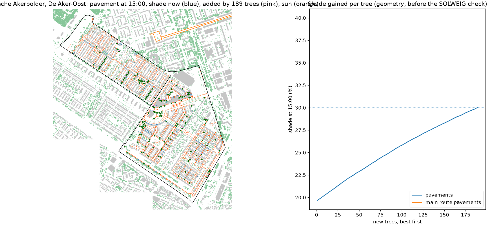

# New trees for Middelveldsche Akerpolder, De Aker-Oost

189 new trees, each 12 m tall with an 8 m crown, chosen one at a time where they add the most shade on 104848 m2 of pavement (0 m2 along the main walking routes), from 21693 possible spots on public pavement and green at least 4 m from facades and 5 m from existing crowns. Cables and pipes are not in open data, so every spot needs the city's check. The full model (SOLWEIG and PET, 1 July 2015) is then run with and without the trees.

| On the neighbourhood's pavements | Now | With the trees | Search estimate |
|---|---|---|---|
| Pavement shade at 11:00 | 25% | 31% |  |
| Pavement shade at 15:00 | 20% | 30% | 30% |
| Pavement shade at 17:00 | 33% | 43% |  |
| Mean Tmrt on pavements at 15:00 | 58.2 C | 54.9 C |  |
| Mean afternoon PET on pavements | 42.1 C | 40.9 C |  |
| Pavement above 41 C PET | 65% | 52% |  |

Where the new crowns shade the pavement (23517 m2), Tmrt at 15:00 drops by 14 C and afternoon PET by 5.3 C on average.

