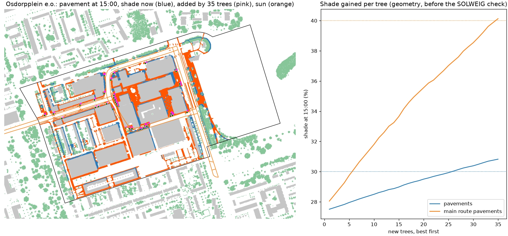

# New trees for Osdorpplein e.o.

35 new trees, each 12 m tall with an 8 m crown, chosen one at a time where they add the most shade on 65067 m2 of pavement (17017 m2 along the main walking routes), from 9198 possible spots on public pavement and green at least 4 m from facades and 5 m from existing crowns. Cables and pipes are not in open data, so every spot needs the city's check. The full model (SOLWEIG and PET, 1 July 2015) is then run with and without the trees.

| On the neighbourhood's pavements | Now | With the trees | Search estimate |
|---|---|---|---|
| Pavement shade at 11:00 | 30% | 33% |  |
| Pavement shade at 15:00 | 27% | 31% | 31% |
| Pavement shade at 17:00 | 31% | 35% |  |
| Main route pavement shade at 15:00 | 28% | 40% | 40% |
| Mean Tmrt on pavements at 15:00 | 57.5 C | 56.3 C |  |
| Mean afternoon PET on pavements | 42.6 C | 42.1 C |  |
| Pavement above 41 C PET | 62% | 58% |  |

Where the new crowns shade the pavement (7082 m2), Tmrt at 15:00 drops by 11 C and afternoon PET by 4.5 C on average.

