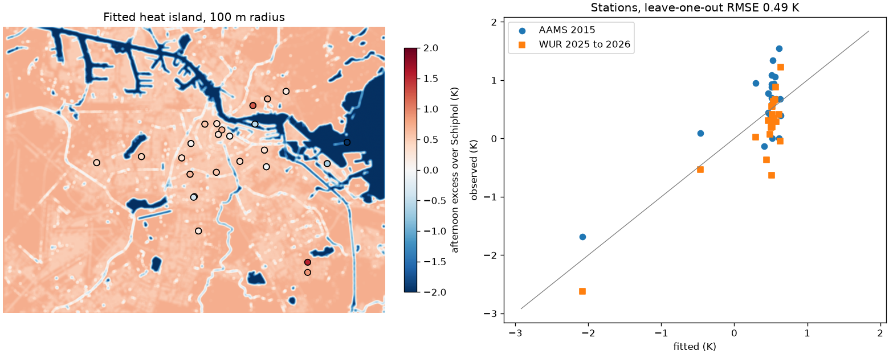

# Afternoon heat island from street stations

The model uses air temperature from Schiphol. On hot afternoons (Schiphol maximum 27 C or more, 12:00 to 18:00) city stations are warmer, and how much depends on what is around them. We fit each station's mean excess over Schiphol to the built-up and water fractions within a radius (ESA WorldCover 2021) and pick the radius with the smallest leave-one-out error.

45 stations: 23 from the 2015 AAMS network (PANGAEA) and 22 from the WUR Distributed Network (2025 and 2026).

| Radius | Leave-one-out RMSE (K) |
|---|---|
| 100 m | 0.49 |
| 250 m | 0.52 |
| 500 m | 0.53 |
| 1000 m | 0.57 |
| none (city mean) | 0.74 |

Chosen: 100 m. Excess = +0.72 -0.21 x built -2.87 x water (K, fractions 0 to 1). Station mean excess +0.36 K, range -2.6 to +1.5 K.

| Station | Network | Excess (K) | Fitted (K) | Built | Water |
|---|---|---|---|---|---|
| Streefkerkstraat | AAMS 2015 | +1.5 | +0.6 | 0.50 | 0.00 |
| Benkoelenstraat | AAMS 2015 | +1.3 | +0.5 | 0.91 | 0.00 |
| Zamenhofstraat | WUR 2025 to 2026 | +1.2 | +0.6 | 0.39 | 0.00 |
| IJburglaan | AAMS 2015 | +1.1 | +0.5 | 0.98 | 0.00 |
| Raphaelstraat | AAMS 2015 | +1.1 | +0.6 | 0.76 | 0.00 |
| Nieuwe Uijlenburgerstaat | AAMS 2015 | +0.9 | +0.3 | 0.80 | 0.09 |
| Tweede Oosterparkstraat | AAMS 2015 | +0.9 | +0.5 | 0.84 | 0.00 |
| Lutmastraat | AAMS 2015 | +0.9 | +0.5 | 0.97 | 0.00 |
| Anjelierstraat | AAMS 2015 | +0.9 | +0.5 | 0.94 | 0.00 |
| Oudezijdsvoorburgwal | AAMS 2015 | +0.9 | +0.5 | 0.99 | 0.00 |
| Scherpenzeelstraat | WUR 2025 to 2026 | +0.9 | +0.6 | 0.72 | 0.00 |
| Kattengat | AAMS 2015 | +0.8 | +0.5 | 0.94 | 0.02 |
| Oudezijdsvoorburgwal | AAMS 2015 | +0.7 | +0.5 | 1.00 | 0.00 |
| Saxenburgerdwarsstraat | AAMS 2015 | +0.7 | +0.6 | 0.67 | 0.00 |
| Galileiplein | AAMS 2015 | +0.7 | +0.6 | 0.44 | 0.00 |
| Purmerweg | AAMS 2015 | +0.7 | +0.5 | 0.86 | 0.00 |
| Raephaelstraat | WUR 2025 to 2026 | +0.7 | +0.6 | 0.76 | 0.00 |
| Purmerweg | WUR 2025 to 2026 | +0.6 | +0.5 | 0.86 | 0.00 |
| Markengauw | AAMS 2015 | +0.6 | +0.5 | 0.94 | 0.00 |
| Lutmastraat | WUR 2025 to 2026 | +0.6 | +0.5 | 0.97 | 0.00 |
| Anjeliersstraat | WUR 2025 to 2026 | +0.5 | +0.5 | 0.94 | 0.00 |
| Kinkerstraat | AAMS 2015 | +0.4 | +0.5 | 0.90 | 0.02 |
| Kwelderweg | WUR 2025 to 2026 | +0.4 | +0.5 | 0.96 | 0.00 |
| Comeniusstraat | WUR 2025 to 2026 | +0.4 | +0.6 | 0.50 | 0.00 |
| Zamenhofstraat | AAMS 2015 | +0.4 | +0.6 | 0.39 | 0.00 |
| Saskia van Uylenburgweg | AAMS 2015 | +0.4 | +0.5 | 0.68 | 0.03 |
| Tweede Oosterparkstraat | WUR 2025 to 2026 | +0.3 | +0.5 | 0.84 | 0.00 |
| Kattengat | WUR 2025 to 2026 | +0.3 | +0.5 | 0.94 | 0.02 |
| Benkoelenstraat | WUR 2025 to 2026 | +0.3 | +0.5 | 0.90 | 0.00 |
| Saxenburgerdwarsstraat | WUR 2025 to 2026 | +0.3 | +0.6 | 0.67 | 0.00 |
| Oudezijdsvoorburgwal_Z | WUR 2025 to 2026 | +0.2 | +0.5 | 0.99 | 0.00 |
| Markengauw | WUR 2025 to 2026 | +0.2 | +0.5 | 0.94 | 0.00 |
| Saskia van Uylenburgweg | WUR 2025 to 2026 | +0.2 | +0.5 | 0.65 | 0.03 |
| Javakade | AAMS 2015 | +0.1 | -0.5 | 0.53 | 0.37 |
| Kinkerstraat | WUR 2025 to 2026 | +0.1 | +0.5 | 0.88 | 0.02 |
| Nieuwe Uilenburgerstraat | WUR 2025 to 2026 | +0.0 | +0.3 | 0.80 | 0.09 |
| Kwelderweg | AAMS 2015 | +0.0 | +0.5 | 0.96 | 0.00 |
| Comeniusstaat | AAMS 2015 | +0.0 | +0.6 | 0.50 | 0.00 |
| Galileiplantsoen | WUR 2025 to 2026 | -0.0 | +0.6 | 0.44 | 0.00 |
| Gustav Mahlerplein | AAMS 2015 | -0.1 | +0.4 | 0.86 | 0.04 |
| Gustav Mahlerplein | WUR 2025 to 2026 | -0.4 | +0.4 | 0.91 | 0.03 |
| Majangracht | WUR 2025 to 2026 | -0.5 | -0.5 | 0.53 | 0.37 |
| Diemerparklaan | WUR 2025 to 2026 | -0.6 | +0.5 | 0.98 | 0.00 |
| Natuureiland IJburg | AAMS 2015 | -1.7 | -2.1 | 0.00 | 0.97 |
| Natuur eiland IJburg | WUR 2025 to 2026 | -2.6 | -2.1 | 0.00 | 0.97 |

On land (less than 10% water within 100 m) the fit is close to a constant +0.5 K, while the stations spread by 0.5 K; land cover at this scale does not explain that spread, so street to street differences in air temperature stay unknown. Most of the fit's skill comes from water, which cools its surroundings by up to 2.9 K. The same street measured in 2015 and in 2025 to 2026 differs by 0.6 K on average, a measure of how much sensors and summers matter.

Data: AAMS stations 2015, Ronda et al. 2017, PANGAEA, CC BY 3.0; MAQ Amsterdam Distributed Network, WUR, CC BY-NC 4.0; ESA WorldCover 2021, CC BY 4.0; KNMI.
