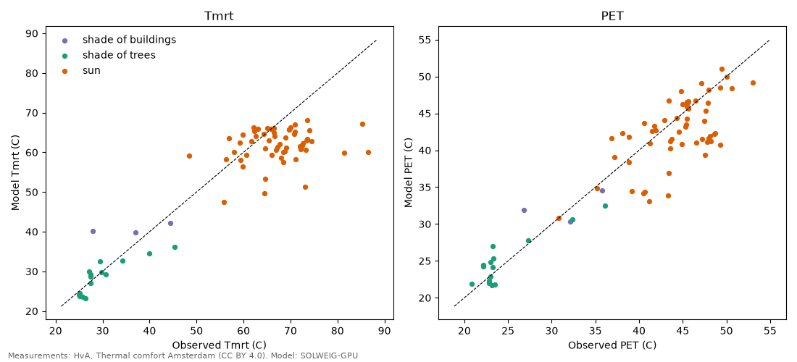

# Model against HvA measurements, Amsterdam 2015 and 2016

75 site-hours with model pixels in the same situation within 40 m (8 without). Observed Tmrt from the 38 mm grey globe (Thorsson et al. 2007); observed PET from the measured air temperature, humidity, wind and that Tmrt.

| Situation | n | Tmrt bias (K) | Tmrt RMSE (K) | Tmrt r | PET bias (K) | PET RMSE (K) |
|---|---|---|---|---|---|---|
| all | 75 | -4.4 | 8.2 | 0.92 | -1.3 | 3.7 |
| shade of buildings | 3 | +4.3 | 7.4 | 0.76 | +0.7 | 3.2 |
| shade of trees | 15 | -1.1 | 3.3 | 0.85 | +0.3 | 1.9 |
| sun | 57 | -5.7 | 9.1 | 0.23 | -1.9 | 4.1 |

The model uses Schiphol air temperature; in the measured squares the air was +0.4 K warmer on average (range -1.5 to +5.3). That part of the PET difference is the urban heat island, not radiation.

## Reading this

The model gets the contrast between sun and shade right (Tmrt r = 0.92) and tree shade well (Tmrt RMSE 3.3 K, PET 1.9 K). In the sun it is 5.7 K too low on average. The radiation forcing is not the cause: on site the measured global radiation was 729 W/m2 against 758 W/m2 at Schiphol, and the errors do not follow the difference.

The largest misses are at Vondelpark (exact spot in the park unknown), Gustav Mahlerplein (glass high rises, changed since 2015) and Amstelplein. On well-defined squares (Dam, Leidseplein, Museumstraat, Stationsplein 2016, Magere Brug) the model is within 3 K.

A likely part of the sun bias is geometry: the globe is a sphere, SOLWEIG computes Tmrt for a standing person, who catches less direct sun when the sun is high. Testing that is next.

The clocks are not the cause either. The HvA radiation sensors follow Schiphol best when their times are read as summer time (r = 0.83, against 0.66 for UTC+1 and 0.45 for UTC), which is how we read them, and SOLWEIG puts the sun in the middle of each hour as intended.

Published comparisons point the same way as the geometry idea: a grey globe read with the Thorsson formula ran 7.7 K above a standing-person reference at open sites in Hong Kong (Ouyang et al. 2022), and small 38 mm globes can be off by more than 10 K in full sun (d'Ambrosio Alfano et al. 2021, Vanos et al. 2021).
