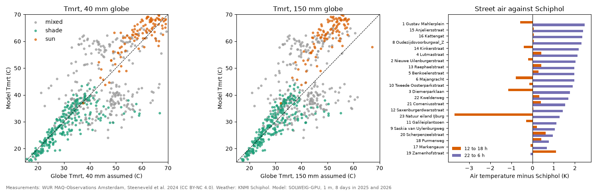

# Model against the WUR street stations, summers 2025 and 2026

The WUR Distributed Network has 23 street stations in Amsterdam with air temperature, humidity and wind, and a black globe thermometer (DS18B20 sensor) at six of them (Steeneveld et al. 2024, MAQ-Observations, CC BY-NC 4.0). We used the eight hottest days with a clear afternoon (Schiphol Tmax at least 27 C, global radiation 12 to 18 h at least 98% of clear sky, all six globes reporting): 14 August 2025 and 19, 24, 25 June, 29 July, 3, 13, 14 August 2026.

Each globe station was run on its 500 m tile at 1 m with Schiphol weather. Model values are the median of non-building, non-water pixels within 7 m of the station (the coordinates are given to about 10 m). An hour is "sun" when at least 75% of those pixels are sunlit and "shade" when at most 25% are. Observed Tmrt comes from hourly globe, air and wind with ISO 7726 (emissivity 0.95). We use the hours ending 08:00 to 20:00 local, 624 station-hours.

## Globe size

Neither the instrument list, the MAQ website nor the network's sensor list on GitHub gives the globe diameter or mounting height. We bracket it with 40 mm (a black table tennis ball) and 150 mm (the standard globe). In full sun the globes run only 6 K above the air at 1.5 m/s, which fits a small globe far better than a 150 mm one.

| Situation | n | Globe | Tmrt bias (K) | Tmrt RMSE (K) | Tmrt r | PET bias (K) | PET RMSE (K) |
|---|---|---|---|---|---|---|---|
| sun | 107 | 40 mm | +2.8 | 5.6 | 0.77 | +2.6 | 4.0 |
| sun | 107 | 150 mm | +12.1 | 12.8 | 0.78 | +6.8 | 7.5 |
| shade | 235 | 40 mm | -2.0 | 6.1 | 0.75 | +0.1 | 3.1 |
| shade | 235 | 150 mm | -0.5 | 4.5 | 0.80 | +0.7 | 2.8 |
| all | 624 | 40 mm | -1.1 | 9.7 | 0.78 | +0.7 | 4.9 |

The sun bias is zero for a 30 mm globe. With the Thorsson et al. (2007) formula used for the HvA grey globes it is -2.6 K. Most sun hours (88 of 107) are at Majangracht.

## Does the HvA sun gap hold?

No. Against the HvA globes the model was 5.7 K too low in the sun. Here, for a small globe, it is between 2.6 K too low and 2.8 K too high depending on the formula, and 12 K too high if the globe were 150 mm. The bias still follows the measured wind (r = -0.49), so the globe convection term remains the largest uncertainty. The clocks agree: observed globe minus air matches the model best with no shift (r = 0.64, against 0.59 and 0.57 one hour either way).

## Air temperature

Street stations minus Schiphol on the same days. In the afternoon most streets are within 0.5 K of Schiphol; at night most are 1 to 2.5 K warmer.

| Station | 12 to 18 h (K) | 22 to 6 h (K) |
|---|---|---|
| 1 Gustav Mahlerplein | -0.6 | +2.5 |
| 2 Nieuwe Uilenburgerstraat | -0.2 | +2.0 |
| 3 Diemerparklaan | -1.2 | +1.8 |
| 4 Lutmastraat | +0.4 | +2.1 |
| 5 Benkoelenstraat | +0.3 | +2.0 |
| 6 Majangracht | -0.8 | +2.0 |
| 8 Oudezijdsvoorburgwal Z | +0.1 | +2.3 |
| 9 Saskia van Uylenburgweg | +0.2 | +1.1 |
| 10 Tweede Oosterparkstraat | -0.1 | +1.9 |
| 11 Galileiplantsoen | -0.3 | +1.1 |
| 12 Saxenburgerdwarsstraat | +0.0 | +1.4 |
| 13 Raphaelstraat | +0.4 | +2.0 |
| 14 Kinkerstraat | -0.4 | +2.2 |
| 15 Anjeliersstraat | +0.1 | +2.4 |
| 16 Kattengat | +0.1 | +2.3 |
| 17 Markengouw | -0.1 | +0.7 |
| 18 Purmerweg | +0.4 | +0.8 |
| 19 Zamenhofstraat | +1.1 | -0.1 |
| 20 Scherpenzeelstraat | +0.6 | +0.9 |
| 21 Comeniusstraat | +0.4 | +1.5 |
| 22 Kwelderweg | +0.3 | +1.7 |
| 23 IJburg nature island | -3.7 | +1.3 |

Station 7 had no data on these days.

## Limits

The globe height is unknown; the model gives Tmrt for a standing person at street level. Several anemometers log only every 50 min and one never did; 40% of hours use the mean street wind of that hour. The station pixel and its 7 m neighbourhood disagree on sun or shade in a quarter of the hours, which is why mixed hours scatter most.

Run with `uv run python scripts/validate_wur.py`.
