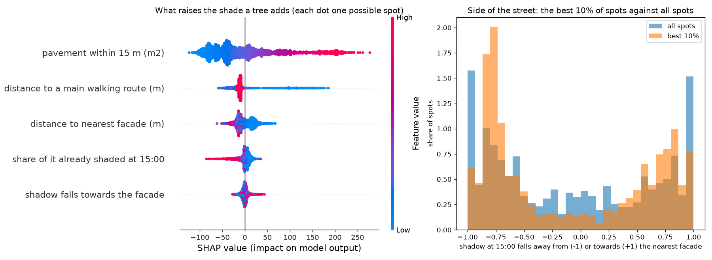

# What makes a spot good for a new tree

For 21722 candidate spots in osdorpplein, de-aker, the shade a tree would add on its own was related to five features of the street with a gradient boosting model, explained with SHAP values. The model explains 60% of the variation between spots (five-fold cross-validation). It explains the physics result; the plans themselves come from the physics.

| Feature | Mean effect on the shade added (weighted m2) |
|---|---|
| pavement within 15 m (m2) | 62.2 |
| distance to a main walking route (m) | 24.5 |
| distance to nearest facade (m) | 15.1 |
| share of it already shaded at 15:00 | 8.2 |
| shadow falls towards the facade | 4.5 |

The strongest driver is pavement within 15 m (m2): a tree helps most where there is a lot of pavement around it; how much of that is already shaded counts for less. Closeness to a main walking route comes next, partly by design, since the search counts route pavement double. Side of the street matters less than one might think: 44% of the best 10% of spots cast their afternoon shadow towards the nearest facade, against 45% of all spots. Neighbouring spots are alike, so the cross-validation score is on the generous side, and features that move together share their credit.

